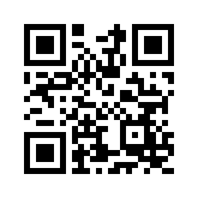
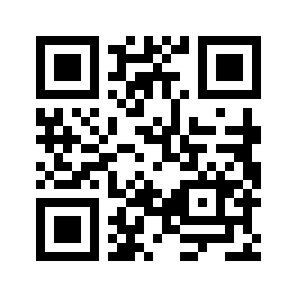
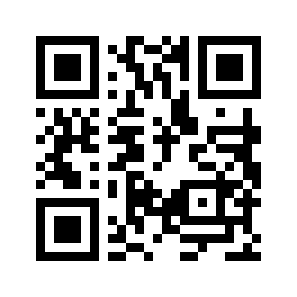
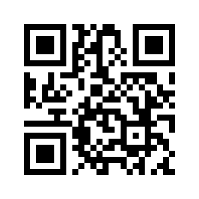
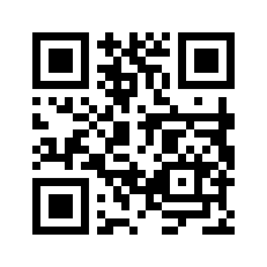
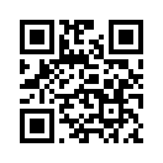

# Saiki Kusuo no Psi Nan: Shijou Psi Dai no Psi nan?!

All QR codes for the QR code menu accessible with the X button in the main menu of Saiki Kusuo no Psi Nan: Shijou Psi Dai no Psi nan?! (00040000001A0D00) (JP).

# QR code #1

QR code data: `BNE_PSY_KUS_05623271`

Content name: 楠子制服冬

For use in: `ふくそう` of `Ψ新ファッション`

QR code:

# QR code #2

QR code data: `BNE_PSY_GEO_51961190`

Content name: ネコ(黄)

For use in: `せいぎょそうち` of `Ψ新ファッション`

QR code:

# QR code #3

QR code data: `BNE_PSY_AMA_81630654`

Content name: ウサギ(先黒)

For use in: `せいぎょそうち` of `Ψ新ファッション`

QR code:

# QR code #4

QR code data: `BNE_PSY_YAM_26734741`

Content name: イヌ(赤)

For use in: `せいぎょそうち` of `Ψ新ファッション`

QR code:

# QR code #5

QR code data: `BNE_PSY_AEO_09667984`

Content name: クマ(紫)

For use in: `せいぎょそうち` of `Ψ新ファッション`

QR code:

# QR code #6

QR code data: `BNE_PSY_TAT_01364692`

Content name: 楠雄はっぴ

For use in: `ふくそう` of `Ψ新ファッション`

QR code:

